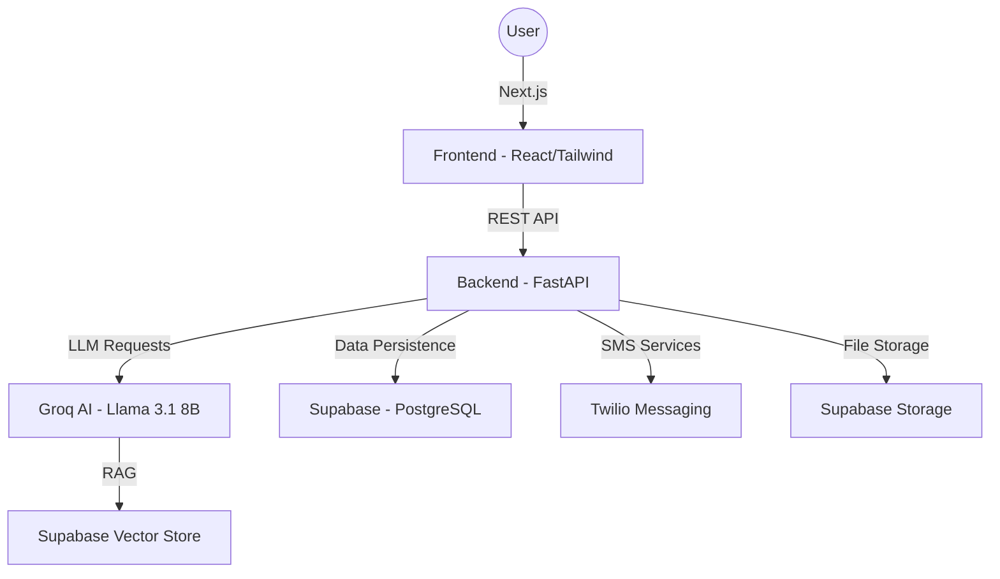

# Vidya Saathi (विद्या साथी) — AI-Powered Multilingual Educational Platform

**Vidya Saathi** is a next-generation adaptive learning platform designed to bridge the educational gap using state-of-the-art AI. It provides personalized, multilingual learning experiences for students, insightful tools for teachers, and real-time monitoring for parents.

---

## 🚀 Key Features

### 1. 🧠 AI-Driven Multilingual Learning
- **Real-time Translation**: Lessons are instantly generated in **English, Hindi, and Telugu** using Groq (Llama 3.1).
- **AI Simplification**: "Explain Like I'm 5" (ELI5) feature to simplify complex topics or provide real-life analogies on demand.
- **Visual Storyboarding**: AI generates animated scene descriptions to help visualize abstract concepts.

### 2. 📝 Adaptive Quiz System
- **Dynamic MCQ Generation**: Quizzes are unique for every student, generated by AI based on the subject and topic.
- **Immediate Feedback**: Students receive detailed AI-generated explanations for every answer choice.
- **Confusion Tracking**: The platform tracks user behavior (hesitation, slow scrolling) to calculate a "Confusion Score" and offer remedial content.

### 3. 💬 Global AI Chat Assistant
- **Context-Aware Assistance**: The AI assistant knows which page you are on and provides relevant help.
- **RAG (Retrieval Augmented Generation)**: Users can upload PDFs or images, which the AI indexes and uses to answer questions accurately.
- **Multi-Role Intelligence**: The assistant adapts its personality and depth based on whether the user is a student, teacher, or parent.

### 4. 📲 Smart SMS Orchestration
- **Twilio Integration**: Sends instant SMS alerts to parents regarding student progress or emergency notifications.
- **E.164 Normalization**: Intelligent phone number formatting to ensure global deliverability.

---

## 🏗️ Architecture & Tech Stack

### High-Level Architecture


### Tech Stack
- **Frontend**: Next.js 14, React, Tailwind CSS, Framer Motion (Animations), Axios.
- **Backend**: FastAPI (Python 3.10+), Pydantic v2, Uvicorn.
- **AI/ML**: Groq Cloud SDK (Llama 3.1 8B, Whisper), RAG with Vector Embeddings.
- **Database**: Supabase (PostgreSQL, Auth, RLS).
- **Communication**: Twilio SMS API.

---

## 🛠️ Installation & Setup

### Prerequisites
- Node.js (v18+)
- Python (v3.10+)
- Supabase Account
- Groq API Key
- Twilio Account

### 1. Backend Setup
```bash
cd backend
python -m venv venv
source venv/bin/activate  # On Windows: venv\Scripts\activate
pip install -r requirements.txt
# Create a .env file based on .env.example
uvicorn main:app --reload
```

### 2. Frontend Setup
```bash
npm install
# Create a .env.local with NEXT_PUBLIC_API_URL=http://localhost:8000
npm run dev
```

---

## 📁 Project Structure
- `/app`: Next.js pages and routing.
- `/components`: Reusable UI components (Chat, Auth, Dashboards).
- `/backend/routes`: FastAPI endpoint definitions.
- `/backend/services`: Core logic (AI, SMS, DB, RAG).
- `/backend/models`: Pydantic schemas for data validation.
- `/lib`: API client and shared TypeScript utilities.

---

## 🤝 Contributing
Contributions are welcome! Please open an issue or submit a pull request for any improvements.

## 📄 License
This project is licensed under the MIT License.
